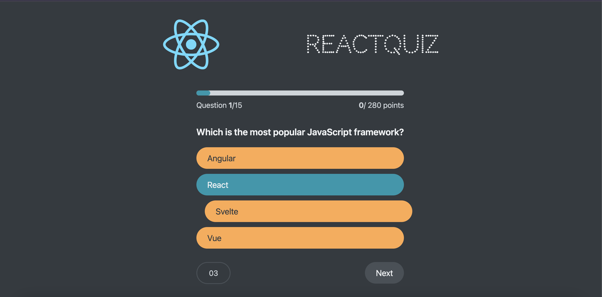

## React-Quiz
It is a simple quiz app. This app is a practice of the useReducer hook of react. Due to the centralized state update logic in the reducer function, the complex state and multiple evt handlers are easily handled. Also the api used is based on the data from the data/questions.json and json-server is used. 

##SnapShots: 

